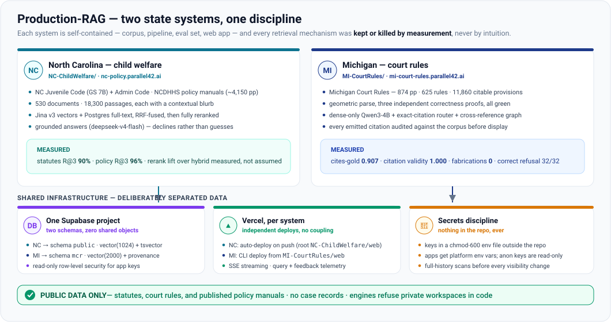
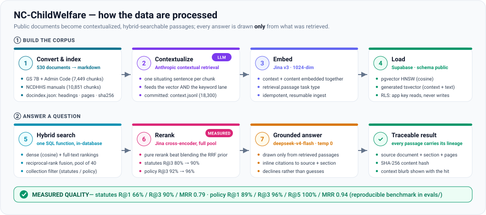
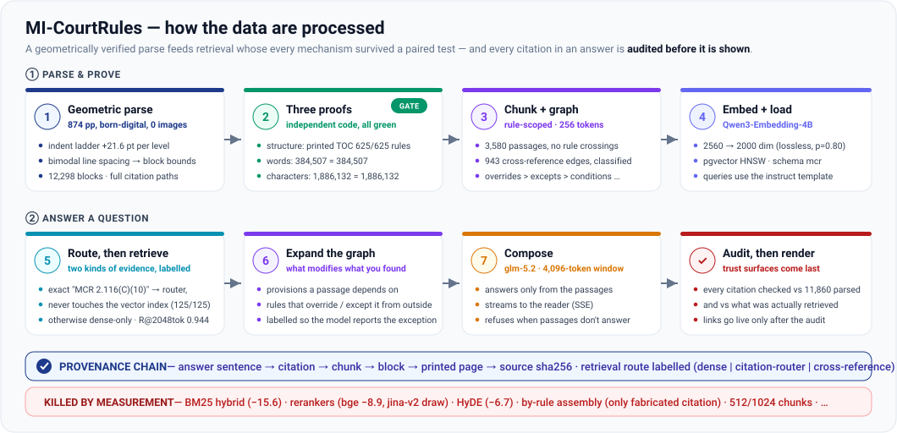

# Production-RAG

Production retrieval-augmented search over **public state law and policy**,
organized by state and corpus — **North Carolina child-welfare law &
policy** and the **Michigan Court Rules**. Each system is self-contained
(corpus, pipeline, evaluation set, web app, database schema) and each is
live. The discipline they share: **every retrieval mechanism was kept or
killed by a measured, paired test — never by intuition** — and every answer
cites sources the reader can check.

This README is the map. Each system has its own detailed README, and the
deep write-ups live one link away.

---

## 🗂 How the repository is laid out

One directory per system, named by state and corpus type. Adding a system
is a new top-level folder with the same internal shape, not new shared code.

| Path | System | Live |
|---|---|---|
| [`NC-ChildWelfare/`](NC-ChildWelfare/) | North Carolina — Juvenile Code (GS 7B), Administrative Code, NCDHHS policy manuals | [nc-policy.parallel42.ai](https://nc-policy.parallel42.ai) |
| [`MI-CourtRules/`](MI-CourtRules/) | Michigan — **Court Rule Searcher**, over the Michigan Court Rules, complete | [mi-court-rules.parallel42.ai](https://mi-court-rules.parallel42.ai) |
| [`docs/assets/`](docs/assets/) | The diagrams on this page | — |

---

## 🌲 NC-ChildWelfare — North Carolina child welfare

Semantic search with grounded, cited answers over two public corpora: the
**NC Juvenile Code and supporting Administrative Code** (7,449 passages)
and the **NCDHHS child-welfare policy manuals** (~4,150 pages, 10,851
passages). Every chunk carries a one-sentence **contextual blurb**
(Anthropic-style contextual retrieval) that feeds both the vector lane and
the keyword lane; retrieval is hybrid (pgvector + Postgres full-text,
reciprocal-rank fused) followed by a **full cross-encoder rerank** — kept
because it measured a lift here (statutes R@3 80→90%), unlike in Michigan,
where reranking measured a draw and was left out. Same method, different
verdicts, both obeyed.

**Read more:** [`NC-ChildWelfare/README.md`](NC-ChildWelfare/README.md) ·
[quality report](NC-ChildWelfare/docs/LAW_SEARCH_QUALITY.md) ·
[attorney-facing explainer](NC-ChildWelfare/docs/law_rag_brief.html) ·
[benchmark](NC-ChildWelfare/evals/)

---

## ⚖️ MI-CourtRules — Court Rule Searcher

A provenance-first search tool over the complete Michigan Court Rules
(874 pages → 12,298 blocks → **11,860 citable provisions** across 625
rules). The parse is proven three independent ways before anything is built
on it; retrieval is dense-only with an **exact-citation router** and a
classified **cross-reference graph** (a rule that overrides or excepts a
retrieved rule is supplied to the model, labelled); and every citation an
answer emits is **audited against the corpus before it is rendered** —
links go live only after the audit. Cites-gold 0.907 · citation validity
1.000 · fabrications 0 · correct refusal 32/32.

**Read more:** [`MI-CourtRules/README.md`](MI-CourtRules/README.md) ·
[testing record & lessons](MI-CourtRules/docs/TESTING-AND-LESSONS.md) ·
[improvement roadmap](MI-CourtRules/docs/IMPROVEMENT-ROADMAP.md) ·
[agentic design notes](MI-CourtRules/docs/AGENTIC-DESIGN.md)

---

## 🧭 What "kept or killed by measurement" means here

Both systems run the same epistemic loop: build an adversarially-validated
eval set first, then subject every proposed mechanism to a **paired test on
identical queries** (McNemar), gated on integrity metrics (correct refusal,
citation validity) before any target metric is read. The Michigan testing
record documents thirteen mechanisms tested and the author's own
recommendation reversed ten times — the surviving system is almost entirely
**deletions**. The NC system's rerank-vs-blend decision came from the same
kind of test. When the two corpora disagree (rerank helps NC, draws in MI),
that is signal about the corpora, not an inconsistency: findings tied to
gold granularity don't transfer between corpora; findings orthogonal to it
transfer exactly.

## 🏛 Shared infrastructure, deliberate separation

| concern | how it's handled |
|---|---|
| Database | One Supabase Postgres project, **two schemas** (`public` for NC, `mcr` for MI) — no shared tables, functions, or policies |
| Web | Vercel, one project per system: `nc-policy` auto-deploys from `NC-ChildWelfare/web` on push; `michigan-court-rules` deploys by CLI from `MI-CourtRules/web` |
| App DB access | Read-only row-level security — app keys can select and call the search functions, never write |
| Secrets | Never in the repo: a chmod-600 env file locally, platform env vars in deployment; full-history scans before every visibility change |
| Data | **Public only** — statutes, court rules, published policy manuals. No case records; the NC engine refuses private workspaces in code |

Both systems are projects of the **Child & Adolescent Data Lab, University
of Michigan School of Social Work**. Research prototypes — not legal advice,
and each interface says so.
